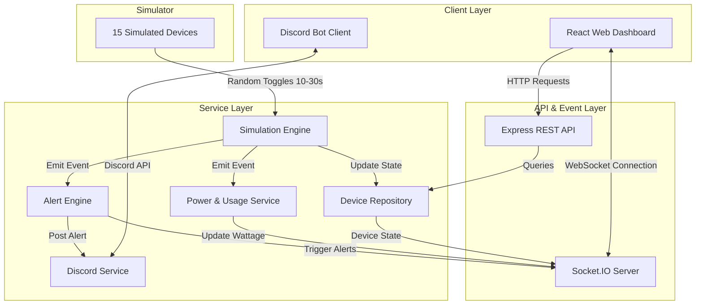

# System Architecture

This document describes the high-level architecture, component communication, and design decisions of the Office IoT Power Monitoring system.

## 1. Architectural Diagram

Below is the layout of how components interact:

---

## 2. Core Service Responsibilities

### `DeviceRepository`
- Manages the state of the 15 devices.
- Uses the repository pattern to abstract data retrieval and state modification.
- Initially in-memory, but designed for drop-in database replacement (e.g., PostgreSQL/MongoDB).

### `SimulationEngine`
- Triggers periodic state changes (every 10-30 seconds).
- Allows starting, stopping, and resetting the simulation.
- Maintains runtime and usage stats.

### `PowerCalculator & DailyUsageEstimator`
- Computes real-time wattage totals for the entire office and individual rooms.
- Approximates daily energy usage in kWh based on active intervals and standard device power ratings.

### `AlertEngine`
- Evaluates constraints on state change notifications:
  - **After Hours**: Is any device active during off-hours (default 9 AM - 5 PM)?
  - **Overtime**: Has any room been completely active for > 2 hours?
  - **High Load**: Does the office total wattage exceed the safe threshold?
- Creates and stores alert logs, then notifies the socket and Discord services.

### `DiscordService`
- Connects to Discord via `discord.js`.
- Registers prefix command listeners (`!status`, `!room`, etc.).
- Exposes an interface for sending automated alerts to a designated Discord channel.

---

## 3. Communication Protocols

- **HTTP REST**:
  - Used for request-reply operations (getting active alerts, manual overrides, simulation management).
- **Socket.IO (WebSocket)**:
  - Used for real-time, low-latency streaming of device state updates, room totals, and alerts.
- **Discord Gateway API**:
  - Handles chatbot commands and incoming webhook-style alerts.

---

## 4. Key Design Trade-offs & Decisions

1. **State Consistency**:
   - The simulation state is stored in a single memory repository in the backend process.
   - Both the React Dashboard and Discord Bot fetch/receive data from this single repository instance, guaranteeing no synchronization drift.
2. **Simulation Clock Rate**:
   - The simulation timer can run faster than real-time (e.g., speed multiplier) to facilitate testing alerts like "Room ON for over two hours" without waiting 2 hours.
3. **Decoupled Alert Notification**:
   - The Alert Engine is fully decoupled from the Discord and WebSocket implementations via an event emitter (or pub-sub service), allowing easy extension to other notification channels (e.g., email, SMS).
